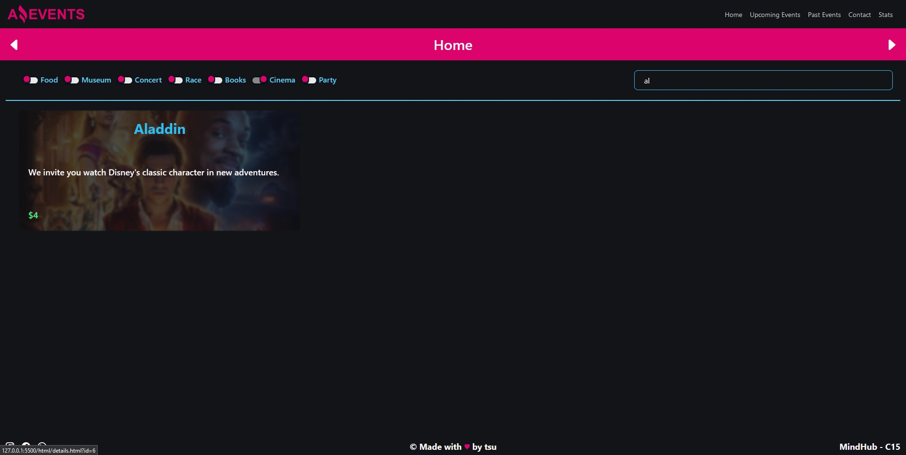
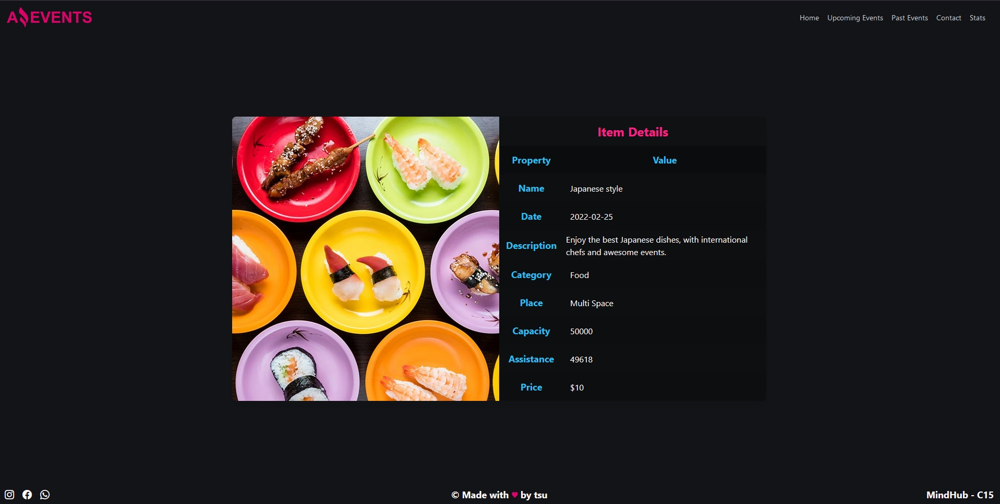
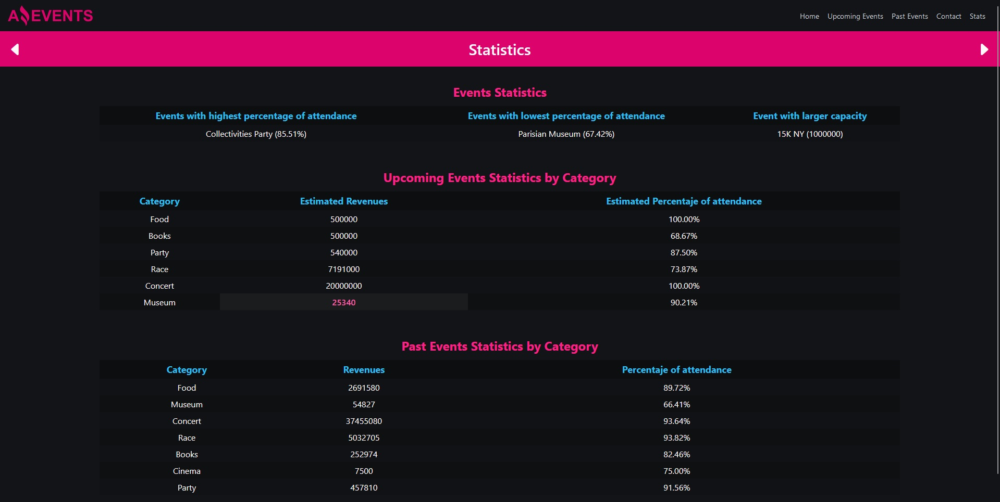
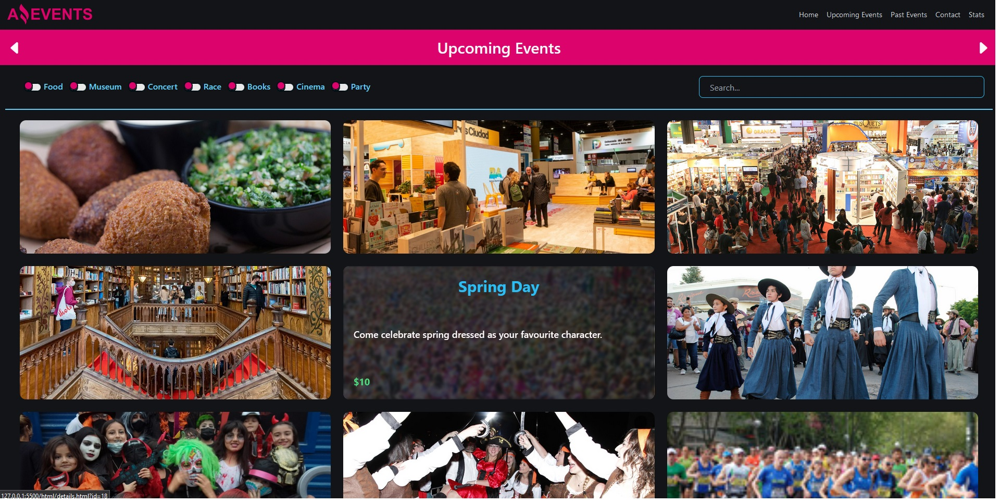

# Amazing Events

["Amazing Events"](https://tsu.is-a.dev/amazing-events/) is a responsive event page project developed for a MindHub Frontend Bootcamp. The project connects to an API to retrieve event data, if it can't, uses a local JSON.
The page is designed to provide a user-friendly experience for browsing and searching for events.

⚠️ Status: No further updates or improvements will be made. The project is now archived for reference.

## Technologies used

* HTML
* TailwindCSS
* Intermediate/Advanced Vanilla JavaScript

### Installation

Go to the [live preview](https://tsuramii.github.io/AmazingEvents_Di-Marco/html/index.html)

or

Download the zip file of the project, unzip it and open index.html

or  

Clone the GitHub repository on your local computer with:

```
    git clone https://github.com/tsuramii/AmazingEvents_Di-Marco.git 
```

then open index.html or run a live server with VSCode

## Features

**Dynamic event charts and statistics:** Connect to an external API and dynamically render event cards and statistics based on the data returned by the API. This feature allows users to quickly visualize and analyze event data in real-time.

**API error handling:** If the external API is not available or returns an error, the application logs the error in the console and automatically switches to a local JSON file to retrieve the event data. This ensures that users can still view and interact with the event cards and statistics even if the API is temporarily unavailable.

**Responsive design:** Ensure that the application layout and user interface is optimized for all screen sizes, including mobile devices and tablets.

**Interactive event filtering:** Allow users to filter the event data based on various criteria, such as category or event's name.

**Event detail view:** Provide a detailed view of individual events that includes additional information such as event description, attendees, and category.

### Branches

In the branches are the tasks that were given to me during the bootcamp,
you can download them to see how the project was progressing.

**Note:** The style for the checkboxes used in this project was done by Voxybuns. All other styling, logic, and code was done 100% by me.

## Screenshots



***



***



***



## License

This project is licensed under the MIT License - see the LICENSE.md for more details.
